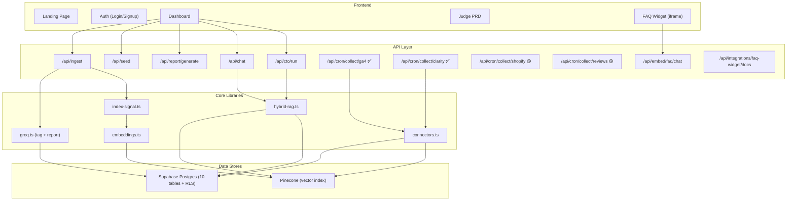

# PulseDesk (KnowledgeLoop MVP) — Project Review

> Reviewed against [prd.md](file:///d:/Hackations/Pulse-Desk/prd.md) and [JUDGE_PRD.md](file:///d:/Hackations/Pulse-Desk/docs/JUDGE_PRD.md)

---

## Summary

The project has **significantly exceeded the original MVP PRD scope**. The original `prd.md` scoped a basic signal dashboard with AI tagging + fallback reports. The codebase now implements a full **AI CTO orchestration system**, **hybrid RAG retrieval**, **FAQ widget**, **Microsoft Clarity integration**, and a **knowledge graph** — all documented in the newer `JUDGE_PRD.md`.

---

## ✅ Completed Features

| # | Feature | PRD Section | Implementation | Notes |
|---|---------|-------------|----------------|-------|
| 1 | **Email/Password Auth** | §1 Auth | [login/page.tsx](file:///d:/Hackations/Pulse-Desk/app/auth/login), [signup/page.tsx](file:///d:/Hackations/Pulse-Desk/app/auth/signup), [AuthForm.tsx](file:///d:/Hackations/Pulse-Desk/components/AuthForm.tsx) | Supabase Auth with SSR cookies |
| 2 | **Auto Business Workspace** | §1 Auth | [schema.sql L142-163](file:///d:/Hackations/Pulse-Desk/supabase/schema.sql#L142-L163) | DB trigger auto-creates business on signup |
| 3 | **RLS Data Isolation** | §1 Auth | [schema.sql L169-248](file:///d:/Hackations/Pulse-Desk/supabase/schema.sql#L169-L248) | RLS on **all 10 tables** — comprehensive |
| 4 | **Signal Ingestion API** | §6 Ingest | `app/api/ingest/route.ts` | POST endpoint with AI tagging |
| 5 | **Demo Data Loader** | §2 Signal Collection | `app/api/seed/route.ts`, [demo.ts](file:///d:/Hackations/Pulse-Desk/lib/demo.ts) | ~10 sample signals across multiple sources |
| 6 | **AI Tagging (Groq)** | §3 AI Tagging | [groq.ts](file:///d:/Hackations/Pulse-Desk/lib/groq.ts) | Llama 3.3 70B, sentiment/topics/urgency |
| 7 | **Deterministic Fallback** | §3 + §4 | [groq.ts](file:///d:/Hackations/Pulse-Desk/lib/groq.ts) | Full fallback for both tagging and reports |
| 8 | **Report Generation** | §4 Reports | `app/api/report/generate/route.ts` | AI + deterministic, with date-range filtering |
| 9 | **Dashboard** | §5 Dashboard | [dashboard/page.tsx](file:///d:/Hackations/Pulse-Desk/app/dashboard/page.tsx) | Metrics, report, signal feed, recommendations, agent trace |
| 10 | **Database Schema** | §DB Schema | [schema.sql](file:///d:/Hackations/Pulse-Desk/supabase/schema.sql) | 10 tables with indexes, RLS, trigger |
| 11 | **Middleware Auth Guard** | §Security | [middleware.ts](file:///d:/Hackations/Pulse-Desk/middleware.ts) | Protected route enforcement |
| 12 | **Vercel Deployment Config** | §Deployment | [vercel.json](file:///d:/Hackations/Pulse-Desk/vercel.json) | Cron schedules configured |
| 13 | **TypeScript Types** | §File Structure | [types.ts](file:///d:/Hackations/Pulse-Desk/lib/types.ts) | Signal, Report, Recommendation, AiRun, ToolCall, Memory |

---

## ✅ Completed (Beyond Original MVP — JUDGE_PRD Features)

| # | Feature | JUDGE_PRD Section | Implementation | Notes |
|---|---------|-------------------|----------------|-------|
| 14 | **Hybrid RAG Retrieval** | §7 Retrieval | [hybrid-rag.ts](file:///d:/Hackations/Pulse-Desk/lib/hybrid-rag.ts) | Vector + keyword + reranking with recency/urgency boosts |
| 15 | **RAG Chat Endpoint** | §10.5 | `app/api/chat/route.ts`, [RagChat.tsx](file:///d:/Hackations/Pulse-Desk/components/RagChat.tsx) | Grounded response generation |
| 16 | **AI CTO Orchestrator** | §8 Agent Model | [app/api/cto/run/route.ts](file:///d:/Hackations/Pulse-Desk/app/api/cto/run) (~11KB) | Multi-agent: DataQuality, Metric, Strategy, Critic, Memory agents |
| 17 | **Recommendations System** | §8 | Schema + dashboard display | With evidence IDs, impact/effort/confidence scoring |
| 18 | **Memory Persistence** | §8 | `memories` table + dashboard display | Key-value facts with confidence scores |
| 19 | **Agent Trace / Tool Calls** | §8 | `ai_runs` + `tool_calls` tables + UI | Full orchestration step visibility |
| 20 | **Knowledge Graph** | §6 Data Model | `entities` + `relationships` tables | Graph nodes and edges with evidence |
| 21 | **Embeddings Module** | §7 | [embeddings.ts](file:///d:/Hackations/Pulse-Desk/lib/embeddings.ts) | Groq embeddings for vector indexing |
| 22 | **Signal Indexing Pipeline** | §7 | [index-signal.ts](file:///d:/Hackations/Pulse-Desk/lib/index-signal.ts) | Chunking + Pinecone upsert |
| 23 | **Connector Framework** | §10 | [connectors.ts](file:///d:/Hackations/Pulse-Desk/lib/connectors.ts) | Generic collect → tag → insert → index pipeline |
| 24 | **Microsoft Clarity Collector** | §10.2 | [clarity provider](file:///d:/Hackations/Pulse-Desk/lib/providers/clarity.ts), `cron/collect/clarity/route.ts` | Real API + demo fallback mode |
| 25 | **GA4 Collector** | §10.1 | `cron/collect/ga4/route.ts` (~4.5KB), `integrations/ga4/connect/` | Connect endpoint + collector |
| 26 | **FAQ Widget System** | §9 | [embed/faq/page.tsx](file:///d:/Hackations/Pulse-Desk/app/embed/faq/page.tsx), `api/embed/faq/`, `api/embed/widget.js/` | Full embed script + iframe chat |
| 27 | **FAQ Doc Upload** | §10.3 | `api/integrations/faq-widget/docs/`, `api/integrations/faq-widget/connect/` | Upload + list docs, scoped retrieval |
| 28 | **FAQ Setup Panel** | §9 | [FaqSetupPanel.tsx](file:///d:/Hackations/Pulse-Desk/components/FaqSetupPanel.tsx) | Dashboard UI for widget config |
| 29 | **FAQ Knowledge Docs** | §10.3 | [faq-docs.ts](file:///d:/Hackations/Pulse-Desk/lib/faq-docs.ts) | Document processing pipeline |
| 30 | **Pinecone Vector DB** | §5 Tech Stack | [pinecone.ts](file:///d:/Hackations/Pulse-Desk/lib/pinecone.ts), [rag.ts](file:///d:/Hackations/Pulse-Desk/lib/rag.ts) | Client setup + namespace management |
| 31 | **Backfill Utility** | — | [backfill.ts](file:///d:/Hackations/Pulse-Desk/lib/backfill.ts) | Retroactive signal processing |
| 32 | **Judge PRD Page** | — | `app/judge/prd/` | Linked from dashboard header |
| 33 | **Demo Mode (No Backend)** | — | [dashboard/page.tsx](file:///d:/Hackations/Pulse-Desk/app/dashboard/page.tsx#L78-L109) | Full demo dashboard without Supabase env |

---

## 🟡 Placeholder / Stub (Route Exists But No Logic)

| # | Feature | Status | File | Notes |
|---|---------|--------|------|-------|
| 1 | **Shopify Collector** | Stub | [shopify/route.ts](file:///d:/Hackations/Pulse-Desk/app/api/cron/collect/shopify/route.ts) | Returns placeholder message; no OAuth or order polling |
| 2 | **Google Reviews Collector** | Stub | [reviews/route.ts](file:///d:/Hackations/Pulse-Desk/app/api/cron/collect/reviews/route.ts) | Returns placeholder message; no Google/Facebook polling |
| 3 | **Cron Report Generator** | Partial | `app/api/cron/report/route.ts` | Exists but likely minimal; cron auth present |

---

## 🔴 Not Started (Planned Post-MVP)

| # | Feature | PRD Section | Priority |
|---|---------|-------------|----------|
| 1 | **Shopify OAuth Integration** | Phase 1 | High — listed as Phase 1 priority |
| 2 | **Google Business Profile Reviews** | Phase 2 | Medium |
| 3 | **Facebook/Instagram Comments** | Phase 2 | Medium |
| 4 | **Full GA4 Real API** (OAuth flow) | Phase 2 | Medium — connect scaffold exists but no real Google API calls |
| 5 | **Email Report Delivery** (Resend) | Phase 2 | Medium |
| 6 | **Slack/WhatsApp Alerts** | Phase 4+ | Low |
| 7 | **Advanced Filtering/Export** | Phase 2 | Medium |
| 8 | **Team Collaboration / Multi-User** | Phase 3 | Low |
| 9 | **Custom Report Templates** | Phase 3 | Low |
| 10 | **Mobile App** | Phase 4+ | Low |
| 11 | **Recommendation Outcome Tracking** | JUDGE_PRD §16 | Medium — `outcomes` table not yet created |
| 12 | **Scheduler Retry Policy** | JUDGE_PRD §16 | Medium |
| 13 | **Queue-Based Ingestion Workers** | JUDGE_PRD §16 | Low |
| 14 | **Multi-Brand / Portfolio Insights** | JUDGE_PRD §16 | Low |
| 15 | **Automated Tests** (unit/integration/e2e) | PRD §Testing | Medium — no test files exist |

---

## Architecture Diagram (Current State)

---

## Key Observations

> [!TIP]
> The project has evolved well beyond the original MVP scope. The JUDGE_PRD captures the real system architecture more accurately than the original prd.md.

> [!IMPORTANT]
> **Shopify and Google Reviews** are the two biggest gaps vs. PRD Phase 1. Both are empty stubs with only auth-check boilerplate.

> [!NOTE]
> The **demo mode** is particularly well-done — the dashboard works entirely without Supabase credentials, using fallback data and deterministic reports. This makes it presentation-ready even offline.

### Strengths
- 🏗️ **Solid infra foundation** — 10-table schema, full RLS, connector framework, vector indexing pipeline
- 🤖 **AI CTO orchestrator** with trace + memory is a significant differentiator
- 🔍 **Hybrid RAG** with synonym expansion, recency/urgency boosting is production-quality retrieval
- 🔌 **FAQ widget** is a full end-to-end feature (embed script → chat → signal feedback loop)
- 💰 **Free-tier viable** — Supabase + Groq + Pinecone all on free plans

### Gaps to Address
- 🧪 **Zero test coverage** — no unit, integration, or e2e tests
- 📊 **No outcome tracking** — recommendations don't track whether they improved metrics
- 🔗 **Real integrations** — Shopify/GBP/Social are still stubs
- 📱 **No responsive/mobile optimization** confirmed
